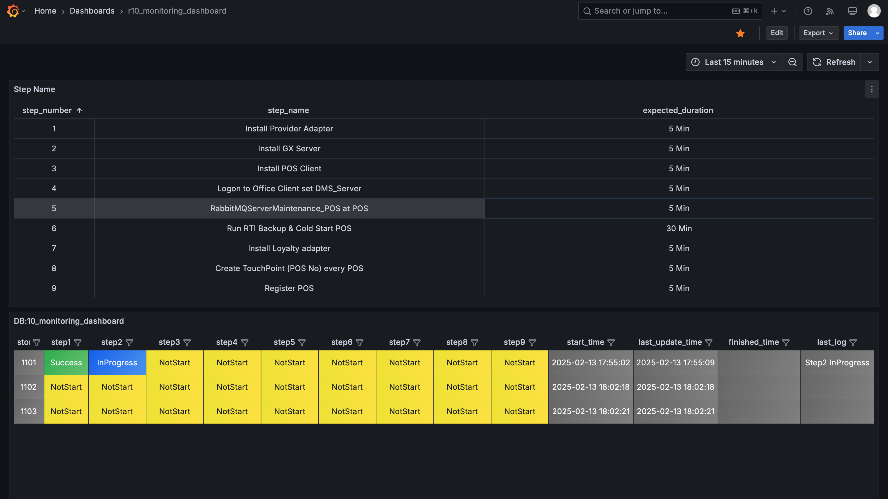

# Deployment Status Management

This repository contains SQL queries for managing deployment status tracking across different stores.

## Overview

The system maintains deployment status information including multiple steps, timestamps, and logging capabilities for each store in the deployment process.

## SQL Operations

### Creating New Deployment Entry

Initializes a deployment for a store. Since 'NotStart' is the default value for all steps, this just inserts a new record:

~~~markdown
INSERT INTO deployment_status (store_name) VALUES (1101);
~~~

### Updating Step Status

Update the status of individual deployment steps. Available status options:
- NotStart
- InProgress
- Success
- Fail

Example of updating Step 1 to Success:

~~~markdown
UPDATE deployment_status
SET status_step1 = 'Success',
    last_log = 'Step1 Success',
    last_update_time = NOW()
WHERE store_name = '1101';
~~~

Example of updating Step 2 to InProgress:

~~~markdown
UPDATE deployment_status
SET status_step2 = 'InProgress',
    last_log = 'Step2 InProgress',
    last_update_time = NOW()
WHERE store_name = '1101';
~~~

### Removing Deployment Status

Remove a store's deployment status record:

~~~markdown
DELETE FROM deployment_status WHERE store_name = '1101';
~~~

## Database Schema

The `deployment_status` table includes the following key fields:
- `store_name`: Store identifier
- `status_step1`: Status of deployment step 1
- `status_step2`: Status of deployment step 2
- `last_log`: Most recent log message
- `last_update_time`: Timestamp of the latest update

## Best Practices

1. Always update both the status and last_log fields to maintain accurate tracking
2. Use the NOW() function for timestamp updates to ensure consistency
3. Verify store existence before performing updates or deletions

## Contributing

Please ensure all SQL queries follow the established patterns above when contributing to this repository.